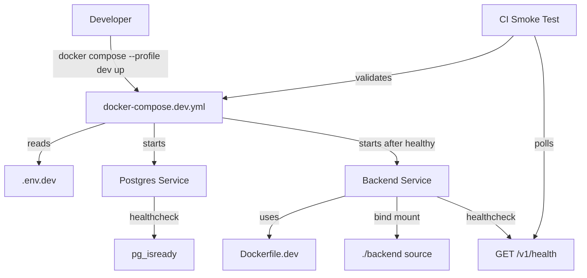

# Design Document: Docker Compose Dev Profile

## Overview

This feature introduces a Docker Compose development profile that enables a one-command local development experience for the MyFans backend. The design separates development-specific configuration from the existing production `docker-compose.yml` using a `docker-compose.dev.yml` override file, a dedicated `Dockerfile.dev` for hot-reload development, and a `.env.dev` file for local environment variables.

The dev profile provides:
- Dependency-ordered startup with health checks
- Hot reload for NestJS backend via bind-mounted source and `nest start --watch`
- Isolated development database volume
- CI smoke test to validate the dev stack
- Manual verification checklist in documentation

This design does not modify the existing production Docker setup. The production `docker-compose.yml` and `backend/Dockerfile` remain unchanged.

## Architecture

### Component Diagram



### Service Dependencies

1. **Postgres Service**: Starts first, declares health check via `pg_isready`
2. **Backend Service**: Starts only after Postgres health check passes (`depends_on: condition: service_healthy`)
3. **Health Endpoint**: Backend exposes `GET /v1/health` returning `{"status":"ok"}` for Docker health checks and CI validation

### File Structure

```
MyFans/
├── docker-compose.yml              # Unchanged production config
├── docker-compose.dev.yml          # New: dev profile override
├── .env.dev.example                # New: template for local secrets
├── .env.dev                        # Git-ignored: actual local secrets
├── .gitignore                      # Updated: add .env.dev
├── DEVELOPMENT.md                  # New: manual verification checklist
├── backend/
│   ├── Dockerfile                  # Unchanged production Dockerfile
│   ├── Dockerfile.dev              # New: dev Dockerfile (no build step)
│   └── src/health/
│       ├── health.controller.ts    # Existing: GET /v1/health
│       ├── health.service.ts       # Existing: returns {status:"ok"}
│       └── health.controller.spec.ts # Updated: add unit test for 200 response
└── .github/workflows/
    └── docker-compose-smoke.yml    # New: CI smoke test workflow
```

## Components and Interfaces

### docker-compose.dev.yml

Override file that defines the `dev` profile. Key properties:

- **Profile**: `dev` (activated via `--profile dev`)
- **Env File**: `env_file: .env.dev` at root
- **Backend Service**:
  - `dockerfile: Dockerfile.dev`
  - `NODE_ENV=development`
  - Volumes: bind-mount `./backend:/app`, anonymous volume `/app/node_modules`
  - Command: `npm run start:dev` (nest start --watch)
  - Health check: `curl -f http://localhost:3001/v1/health || exit 1` (interval 15s, timeout 5s, start_period 30s, retries 3)
  - Depends on: `postgres: condition: service_healthy`
- **Postgres Service**:
  - Health check: `pg_isready -U postgres` (interval 10s, timeout 5s, retries 5)
  - Volume: `postgres_dev_data` (named, separate from production)

### backend/Dockerfile.dev

Development Dockerfile optimized for hot reload:

```dockerfile
FROM node:20-alpine
WORKDIR /app
COPY package*.json ./
RUN npm ci --include=dev
# No COPY . . — source is bind-mounted
# No npm run build — dev mode runs from .ts files
EXPOSE 3001
CMD ["npm", "run", "start:dev"]
```

Key differences from production Dockerfile:
- Installs devDependencies (`--include=dev`)
- No build step
- No source copy (bind-mounted at runtime)
- Runs `start:dev` instead of `start:prod`

### .env.dev.example

Template file at repository root containing all required variables with safe dev defaults:

```env
# Application
NODE_ENV=development
PORT=3001

# Database
DB_HOST=postgres
DB_PORT=5432
DB_USER=postgres
DB_PASSWORD=postgres
DB_NAME=myfans

# Auth
JWT_SECRET=dev-jwt-secret-change-me

# Stellar
STELLAR_NETWORK=testnet
SOROBAN_RPC_URL=https://soroban-testnet.stellar.org

# Startup
STARTUP_MODE=degraded
```

Note: `PORT=3001` is required because `main.ts` defaults to port 3000 (`process.env.PORT ?? 3000`), but the dev stack exposes port 3001 on the host. Setting `PORT=3001` in `.env.dev` ensures the backend listens on the correct port inside the container.

Inline comments explain each variable. Developers copy this to `.env.dev` and customize as needed.

### Health Endpoint

Existing endpoint at `GET /v1/health` (versioned route):

- **Controller**: `HealthController.getHealth()`
- **Service**: `HealthService.getHealth()`
- **Response**: `{ status: "ok", timestamp: "2025-01-01T00:00:00.000Z" }`
- **Status Code**: 200 (always, for basic health check)

This endpoint is used by:
1. Docker health check in `docker-compose.dev.yml`
2. CI smoke test polling
3. Manual verification (`curl http://localhost:3001/v1/health`)

### CI Smoke Test Workflow

New GitHub Actions workflow at `.github/workflows/docker-compose-smoke.yml`:

```yaml
name: Docker Compose Smoke Test

on:
  push:
    branches: [main, develop]
  pull_request:
    branches: [main, develop]

jobs:
  smoke-test:
    runs-on: ubuntu-latest
    timeout-minutes: 10
    steps:
      - uses: actions/checkout@v4
      - name: Copy env template
        run: cp .env.dev.example .env.dev
      - name: Start dev stack
        run: docker compose --profile dev up -d --build
      - name: Wait for health
        run: |
          timeout 60 bash -c 'until curl -f http://localhost:3001/v1/health; do sleep 2; done'
      - name: Print logs on failure
        if: failure()
        run: docker compose --profile dev logs backend
      - name: Cleanup
        if: always()
        run: docker compose --profile dev down -v
```

Key behaviors:
- Runs on push/PR to main/develop
- Copies `.env.dev.example` to `.env.dev` (CI uses safe defaults)
- Starts dev stack with `--build` to ensure fresh image
- Polls health endpoint with 60s timeout
- Prints backend logs on failure
- Always cleans up containers and volumes

### .gitignore Update

Add explicit entry for `.env.dev`:

```
# Environment
.env
.env.*
!.env.example
.env.dev  # Explicit: never commit local dev secrets
```

Rationale: While `.env.*` already excludes `.env.dev`, an explicit entry makes the intent clear and prevents accidental commits if the wildcard pattern is modified.

## Data Models

No new data models. This feature uses existing:

- **HealthCheckResult** (from `health.service.ts`): `{ status: string, timestamp: string }`
- **Environment Variables**: Validated at startup by NestJS ConfigModule

## Correctness Properties

*A property is a characteristic or behavior that should hold true across all valid executions of a system—essentially, a formal statement about what the system should do. Properties serve as the bridge between human-readable specifications and machine-verifiable correctness guarantees.*

### Property 1: Startup Validation Rejects Missing Required Variables

*For any* subset of the required environment variables (DB_HOST, DB_PORT, DB_USER, DB_PASSWORD, DB_NAME, JWT_SECRET) that is non-empty and incomplete, the NestJS application startup validation SHALL reject the configuration and exit with a non-zero code, logging the names of all missing variables.

**Validates: Requirements 5.3**

### Example 1: Health Endpoint Returns 200 with Correct Body

The `GET /v1/health` endpoint SHALL return HTTP status 200 with a JSON body containing `{"status":"ok","timestamp":"<ISO8601>"}` where the timestamp is a valid ISO 8601 string.

**Validates: Requirements 7.3**

### Example 2: docker-compose.dev.yml Declares Correct Health Checks

The `docker-compose.dev.yml` file SHALL declare:
- Postgres health check: `pg_isready -U postgres`, interval 10s, timeout 5s, retries 5
- Backend health check: HTTP GET to `http://localhost:3001/v1/health`, interval 15s, timeout 5s, start_period 30s, retries 3

**Validates: Requirements 4.1, 4.2**

### Example 3: Backend Service Depends on Healthy Postgres

The `docker-compose.dev.yml` backend service SHALL declare `depends_on: postgres: condition: service_healthy` to enforce startup ordering.

**Validates: Requirements 1.1, 4.3**

### Example 4: Backend Service Uses Bind Mount with Anonymous Volume

The `docker-compose.dev.yml` backend service SHALL declare:
- Bind mount: `./backend:/app`
- Anonymous volume: `/app/node_modules`

**Validates: Requirements 3.1, 3.2**

### Example 5: Dockerfile.dev Installs Dev Dependencies Without Build

The `backend/Dockerfile.dev` SHALL contain `npm ci --include=dev` and SHALL NOT contain `npm run build`.

**Validates: Requirements 2.2**

### Example 6: .env.dev.example Contains Required Variables

The `.env.dev.example` file SHALL contain entries for DB_HOST, DB_PORT, DB_USER, DB_PASSWORD, DB_NAME, JWT_SECRET, PORT, STARTUP_MODE, STELLAR_NETWORK, and NODE_ENV with safe dev defaults.

**Validates: Requirements 5.1, 5.4**

### Example 7: .gitignore Excludes .env.dev

The `.gitignore` file SHALL contain an entry for `.env.dev`.

**Validates: Requirements 5.2**

### Example 8: CI Workflow Validates Dev Stack

The `.github/workflows/docker-compose-smoke.yml` file SHALL:
- Start the dev stack with `docker compose --profile dev up -d --build`
- Poll `http://localhost:3001/v1/health` until HTTP 200 or 60s timeout
- Run `docker compose --profile dev down -v` in cleanup step

**Validates: Requirements 7.1, 7.2, 7.3, 7.5**

### Example 9: DEVELOPMENT.md Documents Manual Verification

The `DEVELOPMENT.md` file SHALL document:
- Steps to copy `.env.dev.example` to `.env.dev` and start the dev stack
- How to reset the dev database with `docker compose --profile dev down -v`
- Hot-reload workflow (edit .ts file, observe watcher output)

**Validates: Requirements 8.1, 8.2, 8.3**

### Example 10: docker-compose.dev.yml Uses Isolated Dev Volume

The `docker-compose.dev.yml` SHALL define a named volume `postgres_dev_data` for the postgres service, separate from any production volume name.

**Validates: Requirements 6.4**

## Error Handling

### Missing .env.dev File

**Scenario**: Developer runs `docker compose --profile dev up` without creating `.env.dev`.

**Behavior**: Docker Compose will fail with an error indicating the env_file is missing. The error message will reference `.env.dev`.

**Mitigation**: Documentation in `DEVELOPMENT.md` instructs developers to copy `.env.dev.example` to `.env.dev` as the first step.

### Missing Required Environment Variables

**Scenario**: `.env.dev` exists but is missing required variables (e.g., JWT_SECRET).

**Behavior**: NestJS ConfigModule validation will reject the configuration at startup. The backend container will exit with code 1, logging the missing variable name.

**Mitigation**: `.env.dev.example` includes all required variables with inline comments. Developers are instructed to fill in all values.

### Postgres Health Check Failure

**Scenario**: Postgres container fails to start or health check times out.

**Behavior**: Backend service will not start (blocked by `depends_on: condition: service_healthy`). Docker Compose will show postgres as `unhealthy` in `docker compose ps`.

**Mitigation**: Developers can inspect postgres logs with `docker compose --profile dev logs postgres`. Common causes: port 5432 already in use, volume corruption.

### Backend Health Check Failure

**Scenario**: Backend starts but health check fails (e.g., database connection error, missing env var).

**Behavior**: Docker marks backend container as `unhealthy` after 3 retries. Container continues running but is marked unhealthy in `docker compose ps`.

**Mitigation**: Developers inspect backend logs with `docker compose --profile dev logs backend`. Common causes: database connection failure, missing JWT_SECRET, TypeORM migration error.

### Stale Docker Image

**Scenario**: Developer modifies `Dockerfile.dev` but runs `docker compose --profile dev up` without `--build`.

**Behavior**: Docker Compose reuses the cached image, so changes to `Dockerfile.dev` are not reflected.

**Mitigation**: Documentation instructs developers to use `docker compose --profile dev up --build` to force rebuild. CI always uses `--build`.

### Volume Corruption

**Scenario**: Postgres data volume contains a schema incompatible with current migrations.

**Behavior**: TypeORM will fail to run migrations at startup. Backend container exits with code 1, logging the migration error.

**Mitigation**: Documentation instructs developers to reset the database with `docker compose --profile dev down -v` (removes volumes) followed by `docker compose --profile dev up`.

## Testing Strategy

### Unit Tests

Unit tests verify specific examples and edge cases:

1. **Health Endpoint Response Shape** (`health.controller.spec.ts`):
   - Test: `GET /v1/health` returns 200 with `{status:"ok", timestamp:"<ISO8601>"}`
   - Validates: Example 1 (Requirements 7.3)

2. **Startup Validation** (existing tests in ConfigModule):
   - Test: Missing JWT_SECRET causes startup failure
   - Test: Missing DB_HOST causes startup failure
   - Validates: Property 1 (Requirements 5.3)

### Property-Based Tests

Property-based tests verify universal properties across all inputs:

1. **Startup Validation Rejects All Missing Variable Combinations** (`config.properties.spec.ts`):
   - Property: For any non-empty subset of required variables that is incomplete, startup validation rejects the config
   - Generator: Produce all 2^6 - 2 subsets of {DB_HOST, DB_PORT, DB_USER, DB_PASSWORD, DB_NAME, JWT_SECRET} (excluding empty set and full set)
   - Assertion: Validation fails and error message includes missing variable names
   - Iterations: 100 (covers all 62 invalid subsets multiple times)
   - Tag: **Feature: docker-compose-dev-profile, Property 1: Startup validation rejects missing required variables**
   - Validates: Property 1 (Requirements 5.3)

### Integration Tests

Integration tests verify the dev stack as a whole:

1. **CI Smoke Test** (`.github/workflows/docker-compose-smoke.yml`):
   - Test: Start dev stack, poll health endpoint, verify 200 response
   - Validates: Examples 1, 2, 3, 8 (Requirements 1.1, 4.1, 4.2, 4.3, 7.1, 7.2, 7.3, 7.5)

2. **Manual Verification Checklist** (`DEVELOPMENT.md`):
   - Test: Developer follows checklist to start dev stack and verify health endpoint
   - Test: Developer resets database and verifies clean startup
   - Test: Developer edits .ts file and verifies hot reload
   - Validates: Example 9 (Requirements 8.1, 8.2, 8.3)

### Structural Tests

Structural tests verify file content and YAML structure:

1. **YAML Structure Tests** (optional, can be implemented with a YAML parser in a test):
   - Test: `docker-compose.dev.yml` contains correct health check declarations
   - Test: `docker-compose.dev.yml` contains correct depends_on declaration
   - Test: `docker-compose.dev.yml` contains correct volumes declarations
   - Validates: Examples 2, 3, 4, 10

2. **Dockerfile.dev Content Test** (optional, can be implemented with a regex check):
   - Test: `Dockerfile.dev` contains `npm ci --include=dev`
   - Test: `Dockerfile.dev` does NOT contain `npm run build`
   - Validates: Example 5

3. **.env.dev.example Content Test** (optional):
   - Test: File contains all required variable names
   - Validates: Example 6

4. **.gitignore Content Test** (optional):
   - Test: File contains `.env.dev` entry
   - Validates: Example 7

### Testing Library

- **Unit/Integration**: Jest (existing)
- **Property-Based**: fast-check (existing in backend devDependencies)
- **E2E**: Supertest (existing, used for health endpoint integration test)
- **CI**: GitHub Actions (existing)

### Test Configuration

- **Unit tests**: Run via `npm test` in backend directory
- **Property tests**: Run via `npm test` (Jest discovers `*.properties.spec.ts` files)
- **Property test iterations**: Minimum 100 per test (configured in test file)
- **CI smoke test**: Runs on push/PR to main/develop branches
- **CI timeout**: 10 minutes for smoke test job

### Coverage Goals

- **Unit tests**: Cover health endpoint response shape and startup validation edge cases
- **Property tests**: Cover all combinations of missing required variables (Property 1)
- **Integration tests**: Cover full dev stack startup, health check, and cleanup (CI smoke test)
- **Manual tests**: Cover developer workflow (DEVELOPMENT.md checklist)

Together, these tests provide comprehensive coverage of the dev profile feature, ensuring correctness across all inputs (property tests), specific examples (unit tests), and real-world usage (integration and manual tests).
