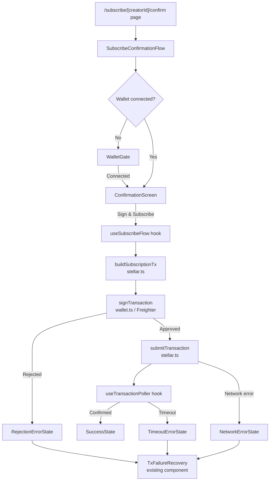

# Design Document: Subscribe Confirmation UI

## Overview

The Subscribe Confirmation UI guides a fan through the final steps of subscribing to a creator on the MyFans platform. The flow is a multi-step, stateful UI that:

1. Gates entry on wallet connection (prompts Freighter install/connect if needed)
2. Displays a confirmation screen with full plan details
3. Builds a Soroban subscription transaction and triggers Freighter signing
4. Submits the signed transaction to the Stellar network
5. Polls for on-chain confirmation with real-time status feedback
6. Handles all failure modes — rejected signatures, network errors, insufficient balance, and timeouts — with specific, actionable recovery UX

The feature is a Next.js page + React component tree, built on top of the existing `useTransaction` hook, `wallet.ts` utilities, `stellar.ts` transaction builder, and the `tx-recovery.ts` guided-recovery library already present in the codebase.

---

## Architecture

The feature follows the existing frontend patterns: a Next.js App Router page delegates to a client component that owns all flow state. Side-effects (wallet calls, network calls) are isolated in hooks and lib modules.



### Flow States

The component manages a single `FlowState` discriminated union:

| State | Description |
|---|---|
| `wallet-gate` | Wallet not connected; show connect/install prompt |
| `confirmation` | Show plan details; fan reviews before signing |
| `awaiting-signature` | Freighter popup open; waiting for fan approval |
| `submitting` | Signed XDR being submitted to Stellar network |
| `polling` | Polling Horizon/Soroban RPC for confirmation |
| `success` | Transaction confirmed; fan is subscribed |
| `error` | Any failure; sub-typed by `TxFailureType` from `tx-recovery.ts` |

---

## Components and Interfaces

### New Components

**`SubscribeConfirmationFlow`** (`src/components/subscribe/SubscribeConfirmationFlow.tsx`)
- Top-level client component; owns `FlowState`
- Renders the correct sub-view for each state
- Accepts `creatorId`, `planId`, `onSuccess`, `onCancel` props

**`WalletGate`** (`src/components/subscribe/WalletGate.tsx`)
- Shown when no wallet is connected
- Detects Freighter installation via `isWalletInstalled()` from `wallet.ts`
- If not installed: shows install prompt with link to `https://freighter.app`
- If installed but not connected: shows "Connect Wallet" button
- On connect success: transitions flow to `confirmation` state

**`ConfirmationScreen`** (`src/components/subscribe/ConfirmationScreen.tsx`)
- Displays: creator name, plan name, price, currency, billing interval
- "Sign & Subscribe" CTA (disabled while flow is in progress)
- "Cancel" secondary action
- Shows connected wallet address

**`SigningStatusIndicator`** (`src/components/subscribe/SigningStatusIndicator.tsx`)
- Shown during `awaiting-signature` state
- Displays "Waiting for wallet approval…" with a spinner

**`PollingStatusIndicator`** (`src/components/subscribe/PollingStatusIndicator.tsx`)
- Shown during `submitting` and `polling` states
- Displays "Confirming your subscription on-chain…" with a progress indicator

**`SubscribeSuccessView`** (`src/components/subscribe/SubscribeSuccessView.tsx`)
- Shown on `success` state
- Displays creator name and "You are now subscribed"
- CTA navigating to creator's gated content

### Reused Components

- **`TxFailureRecovery`** (`src/components/checkout/TxFailureRecovery.tsx`) — already handles all error types from `tx-recovery.ts`
- **`WalletConnect`** (`src/components/WalletConnect.tsx`) — used inside `WalletGate`

### New Hooks

**`useSubscribeFlow`** (`src/hooks/useSubscribeFlow.ts`)
- Orchestrates the full signing + submission sequence
- Returns `{ state, execute, retry, reset }`
- Internally uses `useTransaction` for retry/error state management

**`useTransactionPoller`** (`src/hooks/useTransactionPoller.ts`)
- Polls `checkTransactionStatus(txHash)` at ≤3 second intervals
- Stops on confirmed, failed, or 60-second timeout
- Returns `{ status, elapsedMs }`

### New Page

**`/subscribe/[creatorId]/confirm`** (`src/app/subscribe/[creatorId]/confirm/page.tsx`)
- Server component that reads `creatorId` and `planId` from params/searchParams
- Renders `<SubscribeConfirmationFlow />`

### New Lib Function

**`checkTransactionStatus`** (`src/lib/stellar.ts` — extend existing file)
- Queries Horizon `GET /transactions/{hash}` for confirmation status
- Returns `'pending' | 'confirmed' | 'failed'`

---

## Data Models

### `SubscriptionPlan`

```typescript
interface SubscriptionPlan {
  id: number;
  name: string;
  price: string;          // decimal string, e.g. "9.99"
  currency: string;       // "XLM" or Stellar asset code
  billingInterval: 'monthly' | 'yearly' | 'one-time';
  creatorName: string;
  creatorAddress: string; // Stellar public key
}
```

### `FlowState`

```typescript
type FlowState =
  | { step: 'wallet-gate' }
  | { step: 'confirmation'; plan: SubscriptionPlan; walletAddress: string }
  | { step: 'awaiting-signature'; plan: SubscriptionPlan; walletAddress: string }
  | { step: 'submitting'; plan: SubscriptionPlan; signedXdr: string }
  | { step: 'polling'; plan: SubscriptionPlan; txHash: string }
  | { step: 'success'; plan: SubscriptionPlan; txHash: string }
  | { step: 'error'; plan: SubscriptionPlan | null; error: AppError; retryCount: number };
```

### `TransactionPollResult`

```typescript
type TxPollStatus = 'pending' | 'confirmed' | 'failed' | 'timeout';

interface TransactionPollResult {
  status: TxPollStatus;
  txHash: string;
  elapsedMs: number;
}
```

### State Transition Table

| From | Event | To |
|---|---|---|
| `wallet-gate` | wallet connected | `confirmation` |
| `confirmation` | "Sign & Subscribe" clicked | `awaiting-signature` |
| `confirmation` | "Cancel" clicked | (navigate back) |
| `awaiting-signature` | fan approves | `submitting` |
| `awaiting-signature` | fan rejects | `error` (TX_REJECTED) |
| `awaiting-signature` | wallet error | `error` (WALLET_SIGNATURE_FAILED) |
| `submitting` | submit succeeds | `polling` |
| `submitting` | network error | `error` (NETWORK_ERROR / TX_SUBMIT_FAILED) |
| `polling` | confirmed | `success` |
| `polling` | 60s elapsed | `error` (TX_TIMEOUT) |
| `polling` | tx failed on-chain | `error` (TX_FAILED) |
| `error` | "Try again" | `awaiting-signature` (re-sign) or `submitting` (re-submit) |
| `error` | "Go back" | `confirmation` |

---

## Correctness Properties

*A property is a characteristic or behavior that should hold true across all valid executions of a system — essentially, a formal statement about what the system should do. Properties serve as the bridge between human-readable specifications and machine-verifiable correctness guarantees.*

### Property 1: Confirmation screen displays all required plan fields

*For any* `SubscriptionPlan`, rendering `ConfirmationScreen` with that plan should produce output containing the creator name, plan name, price, currency, and billing interval.

**Validates: Requirements 1.1**

---

### Property 2: "Sign & Subscribe" is disabled while flow is in progress

*For any* `FlowState` where `step` is one of `awaiting-signature`, `submitting`, or `polling`, the "Sign & Subscribe" button should be absent or have `disabled=true`.

**Validates: Requirements 1.4**

---

### Property 3: Build-sign-submit sequence uses correct arguments

*For any* fan wallet address, creator address, and plan ID, when the fan clicks "Sign & Subscribe", `buildSubscriptionTx` should be called with those exact values, then `signTransaction` should be called with the resulting XDR, then `submitTransaction` should be called with the signed XDR — in that order.

**Validates: Requirements 2.1, 2.2, 2.4**

---

### Property 4: Rejection does not call submitTransaction

*For any* signing attempt where `signTransaction` throws `TX_REJECTED`, `submitTransaction` should never be called and the flow should transition to `error` state.

**Validates: Requirements 4.1**

---

### Property 5: Rejection error state shows correct copy and is distinguished from other wallet errors

*For any* `error` state caused by `TX_REJECTED`, the rendered output should contain "Transaction rejected in wallet" and a no-funds-deducted confirmation. *For any* `error` state caused by a different wallet error code (e.g. `WALLET_SIGNATURE_FAILED`), that rejection-specific copy should not appear.

**Validates: Requirements 4.2, 4.4**

---

### Property 6: Polling interval is at most 3 seconds

*For any* sequence of poll calls made by `useTransactionPoller`, the elapsed time between consecutive calls should never exceed 3000 ms.

**Validates: Requirements 3.1**

---

### Property 7: Polling timeout triggers error after 60 seconds

*For any* transaction that remains unconfirmed, `useTransactionPoller` should emit `status: 'timeout'` after at most 60 000 ms and stop issuing further poll calls.

**Validates: Requirements 3.5**

---

### Property 8: Success state shows creator name and subscribed message

*For any* `SubscriptionPlan`, when the flow reaches `success` state, the rendered output should contain the creator's name and the text "You are now subscribed".

**Validates: Requirements 3.3**

---

### Property 9: Network error state shows correct headline and retry action

*For any* `error` state caused by a network-class error (`NETWORK_ERROR`, `TX_SUBMIT_FAILED`, `RPC_ERROR`), the rendered output should contain the headline "Could not reach the network" and a "Retry" action.

**Validates: Requirements 5.1**

---

### Property 10: No-funds-deducted message appears in all pre-submission error states

*For any* `error` state that was reached before `submitTransaction` was called (i.e. `TX_REJECTED`, `TX_BUILD_FAILED`, `WALLET_SIGNATURE_FAILED`, `OFFLINE`), the rendered output should confirm that no funds were deducted.

**Validates: Requirements 5.4**

---

### Property 11: Automatic retry is capped at 3 attempts

*For any* sequence of network-class errors that always fail, `useSubscribeFlow` should attempt automatic retry at most 3 times before transitioning to a permanent failure state.

**Validates: Requirements 5.5**

---

### Property 12: Wallet address is visible on the confirmation screen after connection

*For any* Stellar public key returned by `connectWallet()`, the `ConfirmationScreen` should render that address in the UI.

**Validates: Requirements 6.2**

---

## Error Handling

### Error Classification

All errors are classified using the existing `AppError` / `ErrorCode` system in `src/types/errors.ts` and the `TxFailureType` taxonomy in `src/lib/tx-recovery.ts`. No new error codes are needed.

| Scenario | ErrorCode | TxFailureType | Recovery |
|---|---|---|---|
| Fan rejects Freighter prompt | `TX_REJECTED` | `rejected_signature` | Try again / Go back |
| Freighter not installed | `WALLET_NOT_FOUND` | — | Install link |
| Transaction build fails | `TX_BUILD_FAILED` | `build_failed` | Try again / Go back |
| Network unreachable on submit | `TX_SUBMIT_FAILED` | `rpc_error` | Retry (max 3) |
| Insufficient XLM balance | `INSUFFICIENT_BALANCE` | `insufficient_funds` | Go back |
| Network congestion / high fees | `NETWORK_FEE_ERROR` | `network_congestion` | Retry transaction |
| Polling timeout (60 s) | `TX_TIMEOUT` | `timeout` | Check wallet / Retry |
| On-chain tx failed | `TX_FAILED` | `generic` | Try again / Go back |

### Error Display

All error states render through the existing `TxFailureRecovery` component, which reads from `RECOVERY_GUIDES` in `tx-recovery.ts`. The rejection-specific guide already contains the exact copy required by Requirements 4.2–4.3.

### No-Funds-Deducted Guarantee

The UI must confirm "no funds were deducted" in all error states except `TX_TIMEOUT` (where the transaction may have been submitted). `TxFailureRecovery` already includes this copy for `rejected_signature`, `rpc_error`, `offline`, and `build_failed` guides. The `timeout` guide directs the fan to check their wallet history instead.

---

## Testing Strategy

### Dual Testing Approach

Both unit tests and property-based tests are required. Unit tests cover specific examples and integration points; property tests verify universal correctness across randomized inputs.

### Unit Tests

Located alongside components in `*.test.tsx` / `*.test.ts` files, run with Vitest + jsdom (existing setup).

Key unit test scenarios:
- `WalletGate` renders install link when `isWalletInstalled()` returns `false` (Requirements 6.3)
- `WalletGate` renders connect button when wallet is installed but not connected (Requirements 6.1)
- `ConfirmationScreen` renders "Sign & Subscribe" and "Cancel" buttons (Requirements 1.2, 1.3)
- `SubscribeConfirmationFlow` shows "Waiting for wallet approval" during `awaiting-signature` state (Requirements 2.3)
- `SubscribeConfirmationFlow` shows polling message during `polling` state (Requirements 3.2)
- `SubscribeConfirmationFlow` shows navigation CTA in `success` state (Requirements 3.4)
- Rejection error state renders "Try again" and "Go back" buttons (Requirements 4.3)
- Insufficient balance error state shows "Insufficient balance" headline (Requirements 5.2)
- Network congestion error state shows "Network is congested" headline (Requirements 5.3)
- `useTransactionPoller` stops polling after receiving `confirmed` status

### Property-Based Tests

Use **fast-check** (install: `npm install --save-dev fast-check`) with Vitest. Each property test runs a minimum of 100 iterations.

Each test is tagged with a comment in the format:
`// Feature: subscribe-confirmation-ui, Property N: <property text>`

**Property 1** — Confirmation screen displays all required plan fields
```typescript
// Feature: subscribe-confirmation-ui, Property 1: ConfirmationScreen renders all plan fields
fc.assert(fc.property(arbitraryPlan, (plan) => {
  const { getByText } = render(<ConfirmationScreen plan={plan} walletAddress="GABC..." />);
  expect(getByText(plan.creatorName)).toBeInTheDocument();
  expect(getByText(plan.name)).toBeInTheDocument();
  expect(getByText(plan.price)).toBeInTheDocument();
  expect(getByText(plan.currency)).toBeInTheDocument();
  expect(getByText(plan.billingInterval)).toBeInTheDocument();
}), { numRuns: 100 });
```

**Property 2** — "Sign & Subscribe" disabled during in-progress states
```typescript
// Feature: subscribe-confirmation-ui, Property 2: button disabled in all in-progress states
fc.assert(fc.property(fc.constantFrom('awaiting-signature', 'submitting', 'polling'), (step) => {
  const { getByRole } = render(<SubscribeConfirmationFlow initialState={{ step, ...fixtures }} />);
  expect(getByRole('button', { name: /sign & subscribe/i })).toBeDisabled();
}), { numRuns: 100 });
```

**Property 3** — Build-sign-submit sequence uses correct arguments
```typescript
// Feature: subscribe-confirmation-ui, Property 3: build-sign-submit sequence with correct args
fc.assert(fc.property(arbitraryAddress, arbitraryAddress, fc.integer({ min: 1 }), async (fanAddr, creatorAddr, planId) => {
  await triggerSubscribeFlow(fanAddr, creatorAddr, planId);
  expect(mockBuildTx).toHaveBeenCalledWith(fanAddr, creatorAddr, planId, expect.any(String));
  expect(mockSignTx).toHaveBeenCalledWith(mockBuildTx.mock.results[0].value);
  expect(mockSubmitTx).toHaveBeenCalledWith(mockSignTx.mock.results[0].value);
}), { numRuns: 100 });
```

**Property 4** — Rejection does not call submitTransaction
```typescript
// Feature: subscribe-confirmation-ui, Property 4: rejection never calls submitTransaction
fc.assert(fc.property(arbitraryPlan, arbitraryAddress, async (plan, address) => {
  mockSignTransaction.mockRejectedValue(createAppError('TX_REJECTED'));
  await executeFlow(plan, address);
  expect(mockSubmitTransaction).not.toHaveBeenCalled();
}), { numRuns: 100 });
```

**Property 5** — Rejection copy appears for TX_REJECTED but not for other wallet errors
```typescript
// Feature: subscribe-confirmation-ui, Property 5: rejection copy only for TX_REJECTED
fc.assert(fc.property(
  fc.constantFrom('WALLET_SIGNATURE_FAILED', 'NETWORK_ERROR', 'TX_FAILED'),
  (otherCode) => {
    const { queryByText } = render(<ErrorState error={createAppError(otherCode)} />);
    expect(queryByText(/transaction rejected in wallet/i)).not.toBeInTheDocument();
  }
), { numRuns: 100 });
```

**Property 6** — Polling interval is at most 3 seconds
```typescript
// Feature: subscribe-confirmation-ui, Property 6: poll interval <= 3000ms
fc.assert(fc.property(fc.integer({ min: 2, max: 20 }), async (pollCount) => {
  const intervals = await capturePollingIntervals(pollCount);
  expect(Math.max(...intervals)).toBeLessThanOrEqual(3000);
}), { numRuns: 100 });
```

**Property 7** — Polling timeout after 60 seconds
```typescript
// Feature: subscribe-confirmation-ui, Property 7: timeout emitted after 60s
fc.assert(fc.property(fc.integer({ min: 60000, max: 65000 }), async (elapsedMs) => {
  vi.advanceTimersByTime(elapsedMs);
  const result = await waitForPollerResult();
  expect(result.status).toBe('timeout');
}), { numRuns: 100 });
```

**Property 8** — Success state shows creator name and subscribed message
```typescript
// Feature: subscribe-confirmation-ui, Property 8: success state shows creator name and message
fc.assert(fc.property(arbitraryPlan, (plan) => {
  const { getByText } = render(<SubscribeSuccessView plan={plan} txHash="abc" />);
  expect(getByText(plan.creatorName)).toBeInTheDocument();
  expect(getByText(/you are now subscribed/i)).toBeInTheDocument();
}), { numRuns: 100 });
```

**Property 9** — Network error shows correct headline and retry action
```typescript
// Feature: subscribe-confirmation-ui, Property 9: network error headline and retry
fc.assert(fc.property(fc.constantFrom('NETWORK_ERROR', 'TX_SUBMIT_FAILED', 'RPC_ERROR'), (code) => {
  const { getByText, getByRole } = render(<ErrorState error={createAppError(code)} />);
  expect(getByText(/could not reach the network/i)).toBeInTheDocument();
  expect(getByRole('button', { name: /retry/i })).toBeInTheDocument();
}), { numRuns: 100 });
```

**Property 10** — No-funds-deducted message in pre-submission error states
```typescript
// Feature: subscribe-confirmation-ui, Property 10: no-funds-deducted in pre-submission errors
fc.assert(fc.property(
  fc.constantFrom('TX_REJECTED', 'TX_BUILD_FAILED', 'WALLET_SIGNATURE_FAILED', 'OFFLINE'),
  (code) => {
    const { getByText } = render(<ErrorState error={createAppError(code)} />);
    expect(getByText(/no funds were/i)).toBeInTheDocument();
  }
), { numRuns: 100 });
```

**Property 11** — Automatic retry capped at 3 attempts
```typescript
// Feature: subscribe-confirmation-ui, Property 11: max 3 auto-retries for network errors
fc.assert(fc.property(arbitraryNetworkErrorCode, async (code) => {
  mockSubmitTransaction.mockRejectedValue(createAppError(code));
  const { retryCount } = await runFlowUntilPermanentFailure();
  expect(retryCount).toBeLessThanOrEqual(3);
}), { numRuns: 100 });
```

**Property 12** — Wallet address visible on confirmation screen
```typescript
// Feature: subscribe-confirmation-ui, Property 12: wallet address shown on confirmation screen
fc.assert(fc.property(arbitraryStellarAddress, (address) => {
  const { getByText } = render(<ConfirmationScreen plan={fixturePlan} walletAddress={address} />);
  expect(getByText(new RegExp(address.slice(0, 6)))).toBeInTheDocument();
}), { numRuns: 100 });
```

### Property-Based Testing Library

**fast-check** is the chosen library. It integrates natively with Vitest and supports async properties, which are required for testing the async wallet/network flow.

Install:
```bash
npm install --save-dev fast-check
```

Each of the 12 correctness properties maps to exactly one property-based test. Unit tests cover the remaining example-based acceptance criteria (specific states, specific button existence, specific error headlines for bounded error types).
