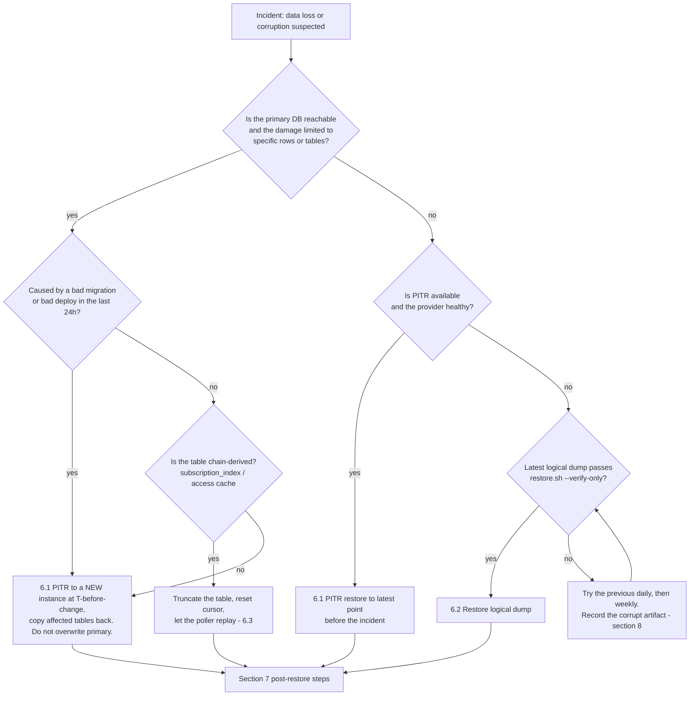

# Postgres Backup / Restore Runbook

> Issue #1855. Owner: **Platform / DBA** (see [Secret Management → Ownership](../backend/docs/SECRET_MANAGEMENT.md#ownership)).
> Approver for production restores: **Platform lead** + **Backend lead**.

The backend Postgres database holds the indexer state (`subscription_index`, poller cursor), plan and creator metadata, the content-access cache, the email outbox, and analytics. Losing it takes analytics and access checks offline. On-chain state stays safe, but rebuilding everything from the chain is slow and not always possible (see [§6.3](#63-rebuild-from-chain-last-resort)). This runbook explains how we back the database up, how we decide which restore path to use, and how we practise restores.

---

## 1. What is in Postgres and how replaceable it is

| Data | Examples | Source of truth | Replaceable without backup? |
|---|---|---|---|
| Indexer state | `subscription_index`, poller cursor (max `ledgerSeq`) | Soroban events | **Partially.** Only within the RPC event-retention window (see §6.3) |
| Access cache | content-access / "is subscriber" cache | Contract `is_subscriber` | Yes. It is a cache and repopulates on read |
| Plan & creator metadata | titles, descriptions, IPFS refs linked to on-chain `plan_id` | **Postgres** | **No** |
| Users & auth | wallet ↔ user mapping, profiles, social links | **Postgres** | **No** |
| Email outbox | `email_outbox` (dedupe via `dedupe_key`) | **Postgres** | No, but losing pending mail is low impact |
| Analytics | aggregates, dashboard summaries | Derived | Yes, by recompute (slow) |

Redis is started with `--save "" --appendonly no` (see `docker-compose.yml`), so it is **not** backed up by design. After any restore, flush it (see §7).

---

## 2. Recovery objectives (RPO / RTO)

| Environment | RPO (max data loss) | RTO (max time to serve again) | Mechanism |
|---|---|---|---|
| **Production** | **≤ 15 min** | **≤ 1 h** for a full-DB loss; **≤ 30 min** for a bad migration or bad write | Managed PITR (continuous WAL archiving) + nightly encrypted logical dump |
| Production, PITR unavailable | ≤ 24 h | ≤ 2 h | Most recent nightly logical dump + indexer replay from restored cursor |
| Staging | ≤ 24 h | ≤ 4 h | Nightly logical dump |
| Local / dev | n/a | n/a | `npm run seed:demo` |

Notes:

- RTO counts from the start of the incident declaration to the moment `GET /v1/health/ready` returns 200 on every API instance with the poller caught up to within 100 ledgers of the chain tip.
- The logical dump is the **second, independent copy**. It covers failures of the provider's PITR, such as account compromise, deletion of the whole instance, or a provider bug.
- Chain-derived tables allow a looser effective RPO. After a restore, the poller replays from the restored cursor, so no on-chain subscription event is lost **if** the gap is still inside RPC event retention.
- Re-measure RTO at every drill (§9). If a drill exceeds the target, open an issue and label it `ops`.

---

## 3. Backup schedule

| Backup | Frequency | Tool | Where it lands |
|---|---|---|---|
| WAL archiving / PITR | Continuous | Managed provider (RDS, Cloud SQL, Neon, Supabase…) or `pgBackRest` / `wal-g` if self-hosted | Provider-managed, encrypted at rest |
| Provider snapshot | Daily, 02:00 UTC | Provider | Provider-managed |
| Logical dump | Daily, 03:00 UTC | [`scripts/postgres/backup.sh`](../scripts/postgres/backup.sh) | Encrypted object storage in a **separate cloud account** |
| Pre-migration dump | Before every production migration / contract upgrade | `backup.sh` with `BACKUP_LABEL=premigration` | Same bucket, `premigration/` prefix |

Example cron entry on the backup host (it must not be an API host):

```cron
0 3 * * * cd /opt/myfans && PGHOST=... PGUSER=backup_ro PGDATABASE=myfans \
  BACKUP_DIR=/var/backups/myfans BACKUP_ENCRYPTION=age BACKUP_AGE_RECIPIENT=age1... RETAIN_DAYS=2 \
  scripts/postgres/backup.sh | xargs -I{} sh -c 'aws s3 cp {} s3://myfans-db-backups/daily/ && aws s3 cp "$(dirname {})"/*.manifest.json s3://myfans-db-backups/daily/'
```

`backup.sh` does the following:

1. Runs `pg_dump --format=custom` (compressed, no owners or grants).
2. Proves the archive is readable with `pg_restore --list` and aborts if it is not.
3. Records SHA-256 of the plaintext dump and of the encrypted artifact in a `*.manifest.json`.
4. Encrypts with `age` (recommended for production, public-key only on the backup host) or `gpg` symmetric. It **refuses to write an unencrypted backup** unless `ALLOW_UNENCRYPTED=1` is set, which is for local drills only.
5. Prunes local copies older than `RETAIN_DAYS`. Remote retention is handled by bucket lifecycle rules (§4).

Alert if no new object appears under `daily/` within 26 h. Use a bucket-notification or monitoring rule, and page the Platform owner.

---

## 4. Retention

| Tier | Keep | Implementation |
|---|---|---|
| PITR window | 7 days | Provider setting |
| Daily logical dumps | 14 days | Bucket lifecycle rule on `daily/` |
| Weekly (Sunday's daily copied to `weekly/`) | 8 weeks | Lifecycle on `weekly/` |
| Monthly (1st of month copied to `monthly/`) | 12 months | Lifecycle on `monthly/` |
| Pre-migration dumps | 30 days after the migration | Lifecycle on `premigration/` |

Retention is also bounded by privacy obligations. A user deletion request is **not** retroactively applied to backups. Instead, backups expire through the lifecycle above, and restores re-apply deletions from the deletion log (§7, step 6).

---

## 5. Security: encryption and access control

- **Encryption at rest, twice.** Artifacts are encrypted client-side before upload (age or gpg AES-256), and the bucket also enforces server-side encryption (SSE-KMS or equivalent).
- **Key custody.**
  - The age **private** identity or gpg passphrase (`BACKUP_ENCRYPTION_KEY`) lives only in the secret manager, never on the backup host. The backup host holds only the age **public** recipient.
  - Access follows [Secret Management](../backend/docs/SECRET_MANAGEMENT.md). The owner is Platform / DBA. Rotate on compromise or yearly, and keep old identities readable until every backup encrypted with them has expired (§4).
- **Least privilege.**
  - `backup_ro` is a Postgres role with `pg_read_all_data` only (no superuser) and is used by `backup.sh`.
  - The backup host's cloud credentials can `PutObject` to the bucket and nothing else: no `Delete`, no `Get`.
  - Restore credentials (`GetObject` plus the decryption key) are break-glass. They are granted per incident, logged, and revoked afterwards.
- **Immutability.** Enable object lock or versioning with MFA delete on the backup bucket, so a compromised app or backup host cannot delete or overwrite history.
- **Separate blast radius.** The bucket sits in a different cloud account or project from the production database.
- **No backups in CI.** The CI drill (§9) uses synthetic data only. Production dumps are never downloaded to laptops or CI runners. Restores run on the production network, on a host that has been approved for them.

---

## 6. Restore decision tree



Text version:

1. **Contain first.** Scale the API and workers to zero, or set the maintenance flag, if they are writing bad data. Stop `worker-poller` so it does not advance the cursor over a broken database.
2. **Partial damage while the primary is alive** → PITR into a **new** instance, then copy the affected rows back. Never roll the primary itself back unless the whole database is bad.
3. **Chain-derived table damaged only** → truncate it and replay (§6.3). No backup is needed.
4. **Primary lost** → PITR (§6.1). If PITR is unavailable, use the newest logical dump that verifies (§6.2).
5. **A backup fails verification** → move to the next older artifact, and record the corrupt one (§8).

### 6.1 PITR restore (preferred)

1. In the provider console or CLI, restore to a **new** instance at the chosen timestamp, which should be just before the incident.
2. Verify connectivity and row counts on the new instance (queries in §7).
3. Repoint `DB_HOST` in the secret manager to the new instance and roll the API and workers.
4. Keep the old instance, stopped, for 7 days for forensics.

### 6.2 Logical dump restore

```bash
# On the approved restore host, with break-glass credentials:
aws s3 cp s3://myfans-db-backups/daily/myfans-<stamp>.dump.age .
aws s3 cp s3://myfans-db-backups/daily/myfans-<stamp>.manifest.json .

# 1. Verify only: checksum, decrypt, readable table of contents. Touches no database.
BACKUP_AGE_IDENTITY=/run/secrets/backup-age-identity \
  scripts/postgres/restore.sh --verify-only myfans-<stamp>.dump.age

# 2. Create an EMPTY target database, then restore into it.
createdb myfans_restored
PGDATABASE=myfans_restored BACKUP_AGE_IDENTITY=/run/secrets/backup-age-identity \
  scripts/postgres/restore.sh myfans-<stamp>.dump.age
```

`restore.sh` refuses to write into a database that already has tables (exit code 4) unless you pass `--force`. Only pass `--force` when overwriting is the explicit decision of the incident lead.

| Exit | Meaning | Action |
|---|---|---|
| 0 | Restored (or verified with `--verify-only`) | Continue to §7 |
| 1 | Usage or config error (missing key, tool, or file) | Fix the environment and retry |
| 3 | Corrupt or unverifiable backup (checksum, decryption, or TOC failure) | §8, then try an older artifact |
| 4 | Target not empty | Use a fresh database, or `--force` with sign-off |
| 5 | `pg_restore` failed mid-way | Drop the target database, check the Postgres version and extensions, then retry |

Then swap the restored database in, either by renaming it or by repointing `DB_NAME` / `DB_HOST`.

### 6.3 Rebuild from chain (last resort)

Chain-derived tables (`subscription_index`, access cache, and analytics derived from events) can be rebuilt by resetting the poller cursor and letting it replay. Handlers are idempotent on `ledgerSeq:eventIndex` (see [Event Indexing](../backend/docs/EVENT_INDEXING.md)).

**Limitation:** Soroban RPC keeps events for a limited window only, typically about 7 days (check your provider). Older ledgers cannot be replayed from RPC and would need a history archive or indexer service. This is why chain data still needs backups.

---

## 7. Post-restore checklist

1. Run pending migrations: `cd backend && npm run migration:run`.
2. Check key tables against expectations. `restore.sh` prints row counts for every public table. Compare them with the manifest date and with the latest analytics dashboard figures.
3. Flush Redis (`redis-cli FLUSHALL`), because the cache may reference state newer than the restore point.
4. Start `worker-poller`. It resumes from the restored cursor and replays the gap. Watch the poller-lag metric ([Metrics](../backend/docs/METRICS_GRAFANA.md)) until lag is under 100 ledgers.
5. Check `email_outbox` for rows in `PENDING` that were already sent before the incident. `dedupe_key` blocks duplicates of replayed events, but pause the outbox worker if in doubt.
6. Re-apply any user deletions or privacy requests logged after the restore point.
7. Confirm `GET /v1/health/ready` returns 200 on every instance, then lift maintenance mode.
8. Record the incident in the change log: timestamps, the artifact used, the measured RPO (restore point → incident) and RTO (declaration → ready).

---

## 8. Corrupt or missing backups

- **Detection:** `backup.sh` refuses to publish an archive that `pg_restore --list` cannot read. `restore.sh` checks the ciphertext SHA-256 before decrypting and the plaintext SHA-256 after, then reads the TOC. Any mismatch exits with code 3.
- **During an incident:** fall back to the next older daily, then weekly, then monthly artifact. Each step back increases data loss, so record the effective RPO.
- **Afterwards:** keep the corrupt artifact (do not delete it), open an issue labelled `ops` with the artifact name and the failing check, and run a manual drill against the next scheduled backup.
- **Missing manifest:** the backup is treated as unverifiable. If there is no other option, restore it into a scratch database and inspect it manually. Never restore it straight into production.

---

## 9. Drills

### Automated (CI)

[`.github/workflows/postgres-restore-drill.yml`](../.github/workflows/postgres-restore-drill.yml) runs weekly (Wednesday 04:00 UTC), on manual dispatch, and on PRs that touch `scripts/postgres/`. It runs [`scripts/postgres/drill.sh`](../scripts/postgres/drill.sh) against a throwaway Postgres 15 container and synthetic seed data. The drill:

1. Seeds a source database (plans, subscriptions, indexer cursor, access cache).
2. Takes an encrypted backup with a per-run random key.
3. Restores into an empty database and asserts that row counts and the cursor match.
4. Asserts that a restore into a non-empty target is refused (exit 4).
5. Asserts that a truncated artifact is rejected (exit 3).
6. Asserts that a wrong decryption key is rejected (exit 3).

The results table is written to the job summary.

Run it locally against any **disposable** server:

```bash
PGHOST=localhost PGPORT=5432 PGUSER=postgres PGPASSWORD=postgres scripts/postgres/drill.sh
```

The drill refuses database names that look real (`myfans`, `postgres`, or anything containing `prod`).

### Manual (quarterly, production-shaped)

Once a quarter, the Platform owner:

1. Picks a random daily artifact from the last 14 days.
2. Runs `restore.sh --verify-only`, then restores into a scratch instance of production size on the production network.
3. Times it: download, then verify, then restore, then migrations, then a poller catch-up simulation.
4. Records the result below and destroys the scratch instance.

| Date | Operator | Artifact | Verify | Restore time | Measured RTO | Within target? | Notes |
|---|---|---|---|---|---|---|---|
| _yyyy-mm-dd_ | | | | | | | |

---

## Related

- [Secret Management](../backend/docs/SECRET_MANAGEMENT.md): `DB_PASSWORD` and backup encryption key custody and rotation
- [Event Indexing](../backend/docs/EVENT_INDEXING.md): poller idempotency and cursor replay
- [Contract Upgrade Governance](CONTRACT_UPGRADE_GOVERNANCE.md): take a pre-migration dump before upgrades
- Out of scope: multi-region active-active replication
